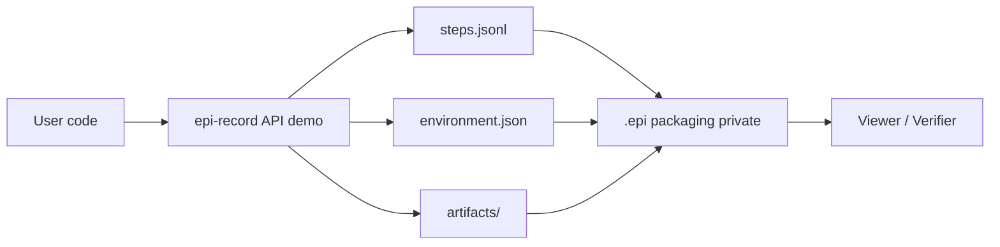

# Architecture (public demo)

EPI records code execution, LLM calls, environment, and artifacts into a single shareable package (.epi).
The public demo shows the interface. Full signing and packaging are private.

## High-level components
1. User code -> EPI Recorder (public API)
2. Recorder -> steps.jsonl, environment.json, artifacts/
3. (Private) Packaging & Signing -> .epi archive
4. Viewer / Verifier -> loads .epi and validates signature

## Mermaid diagram

## Components

### Public API (demo/api_demo.py)
- Context manager for recording sessions
- Step logging (session.start, llm.request, llm.response, session.end)
- Environment capture (platform, Python version)
- Artifact tracking

### Private Components (not in public-demo)
- Ed25519 signing and key management
- ZIP packaging with signature integration
- OpenAI SDK auto-patching
- Full test suite (191 tests)
- Build scripts and distribution
- PyPI packaging internals

## Data Flow

1. **Recording Phase**
   - User code enters `record_demo()` context
   - Steps logged to `steps.jsonl` as JSONL
   - Environment captured to `environment.json`
   - Artifacts referenced with paths and hashes

2. **Packaging Phase (Private)**
   - All files collected into ZIP structure
   - Manifest created with file hashes
   - Ed25519 signature generated
   - Final `.epi` file produced

3. **Verification Phase (Private)**
   - `.epi` file loaded and signature verified
   - Viewer replays steps in sequence
   - Artifacts validated against hashes

## Security Model

- **Demo**: Shows recording interface only
- **Private**: Signing ensures tamper-proof packages
- **Full version**: Cryptographic chain of custody from recording to verification
